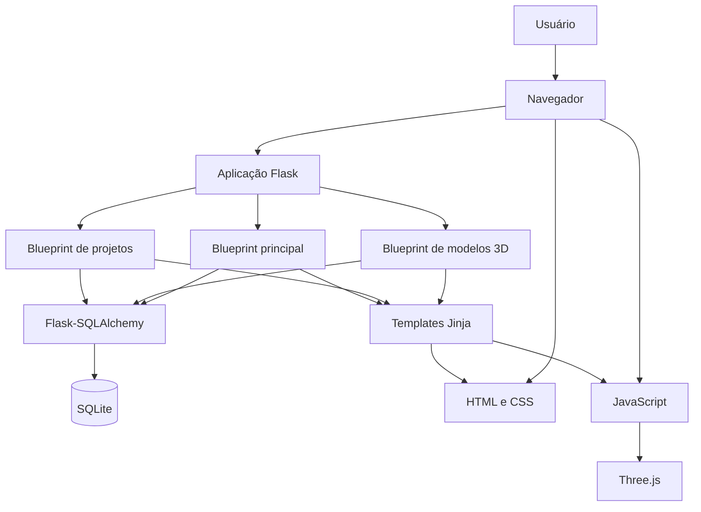
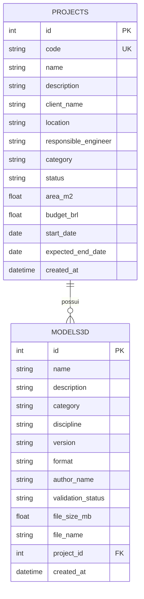
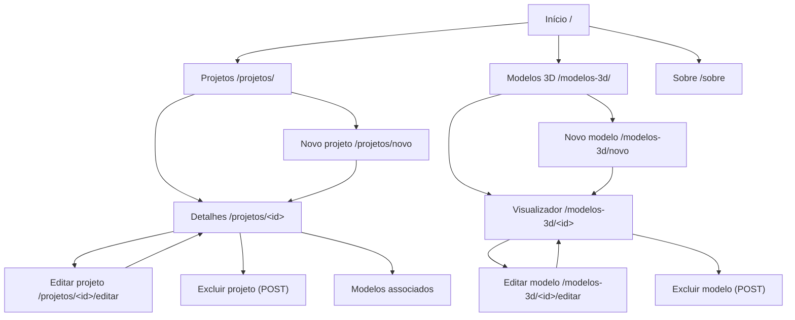
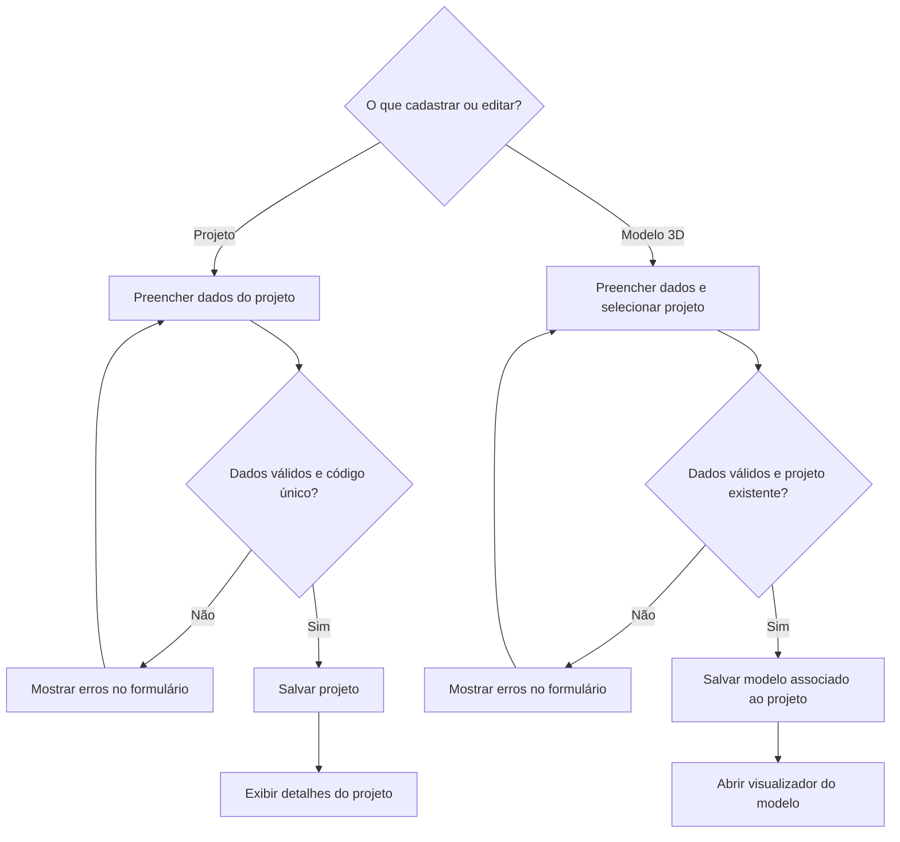

# Wiki — Construtor Project

## Visão geral

O **Construtor Project** é uma aplicação web para organizar projetos de construção civil e seus modelos 3D. O sistema reúne informações de cada obra, permite acompanhar seu status e oferece uma visualização 3D interativa.

## Funcionalidades

### Projetos

- Consulte o catálogo de projetos e pesquise por nome, código ou cliente.
- Filtre a lista por categoria (Residencial, Comercial, Industrial ou Institucional) e status (Planejamento, Em andamento ou Concluído).
- Abra os detalhes de um projeto para consultar cliente, localização, responsável técnico, área, orçamento e datas.
- Cadastre, edite ou exclua projetos. O código do projeto deve ser único; área e orçamento devem ser maiores que zero.
- Modelos 3D associados a um projeto são excluídos junto com ele.

### Modelos 3D

- Consulte os modelos cadastrados e abra um modelo para visualização interativa.
- Use os controles de órbita, zoom e deslocamento para explorar a visualização.
- Cadastre, edite ou exclua modelos vinculados a um projeto.
- Registre categoria, disciplina, versão, formato, autoria, status de validação e tamanho do arquivo.
- O status de validação pode ser Pendente, Em revisão ou Aprovado.

## Diagramas do projeto

Os diagramas abaixo descrevem a arquitetura, os dados e os principais fluxos da aplicação. Eles são escritos em Mermaid e podem ser renderizados diretamente nesta wiki.

### Arquitetura



### Modelo de dados



Cada modelo 3D pertence a um projeto. Ao excluir um projeto, seus modelos associados também são excluídos.

### Navegação



### Fluxos de cadastro e edição



### Renderização do visualizador 3D

```mermaid
sequenceDiagram
    actor Usuario
    participant Navegador
    participant Flask
    participant Banco as SQLite
    participant Three as Three.js

    Usuario->>Navegador: Abre /modelos-3d/&lt;id&gt;
    Navegador->>Flask: Solicita página do modelo
    Flask->>Banco: Busca modelo pelo ID
    Banco-->>Flask: Metadados do modelo
    Flask-->>Navegador: Template do visualizador e categoria
    Navegador->>Three: Inicializa cena e geometria da categoria
    Three-->>Navegador: Renderiza modelo esquemático
    Usuario->>Navegador: Orbita, aproxima ou desloca a visualização
    Navegador->>Three: Atualiza câmera e controles
```

O visualizador atual gera uma geometria esquemática no navegador conforme a categoria do modelo; não carrega um arquivo 3D armazenado.

## Como usar

1. Inicie a aplicação seguindo as instruções de instalação abaixo.
2. A página inicial apresenta um resumo dos projetos e modelos cadastrados.
3. Acesse **Projetos** para pesquisar, filtrar ou abrir um projeto. Use a opção de cadastro para incluir um novo.
4. Acesse **Modelos 3D** para consultar os modelos e selecionar um para visualizar.
5. Para criar um modelo, primeiro deve existir ao menos um projeto ao qual vinculá-lo.

## Instalação e execução

### Requisitos

- Python 3.12 ou superior
- pip

### Passos

Na raiz do repositório, instale as dependências e inicie o servidor:

```bash
pip install -r requirements.txt
flask run
```

Abra `http://127.0.0.1:5000` no navegador. O aplicativo usa SQLite por padrão, cria as tabelas automaticamente e inclui dados de exemplo quando o banco ainda não contém projetos.

## Páginas e rotas

| Página | Rota | Descrição |
|---|---|---|
| Início | `/` | Resumo da quantidade de projetos e modelos |
| Sobre | `/sobre` | Informações sobre a aplicação |
| Projetos | `/projetos/` | Catálogo com busca e filtros |
| Detalhes do projeto | `/projetos/<id>` | Informações e modelos associados ao projeto |
| Novo projeto | `/projetos/novo` | Cadastro de projeto |
| Editar projeto | `/projetos/<id>/editar` | Atualização de projeto |
| Modelos 3D | `/modelos-3d/` | Lista de modelos cadastrados |
| Visualizador 3D | `/modelos-3d/<id>` | Visualização interativa do modelo |
| Novo modelo | `/modelos-3d/novo` | Cadastro de modelo associado a um projeto |
| Editar modelo | `/modelos-3d/<id>/editar` | Atualização de modelo |

As operações de exclusão são realizadas por formulário e não possuem uma página GET pública.

## Configuração

Estas variáveis de ambiente podem ser usadas para ajustar a execução:

| Variável | Padrão | Finalidade |
|---|---|---|
| `FLASK_ENV` | `development` | Seleciona a configuração de ambiente |
| `SECRET_KEY` | Gerada aleatoriamente | Assinatura da sessão Flask |
| `DATABASE_URL` | `sqlite:///construtor.db` | URI do banco de dados |

## Tecnologias

- **Backend:** Python e Flask
- **Banco de dados/ORM:** SQLite e Flask-SQLAlchemy
- **Interface:** HTML e CSS responsivo
- **Visualização 3D:** Three.js
- **Testes:** pytest

## Testes

Instale pytest e execute a suíte a partir da raiz do projeto:

```bash
pip install pytest
python -m pytest -q
```
